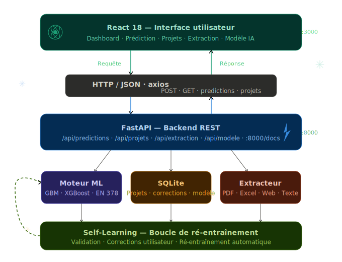

# FroidAI — Système de Prédiction Chambres Froides & Climatisation Adiabatique


---

## 🧊 Présentation

**FroidAI** est un système d'intelligence artificielle auto-apprenant conçu pour les professionnels du froid industriel et de la climatisation adiabatique en Tunisie et en Afrique du Nord. Il analyse des données de projets (PDF, Excel, sites web, saisie manuelle) et prédit automatiquement :

- Le **nombre d'équipements** nécessaires (unités adiabatiques, évaporateurs, condenseurs)
- Le **débit d'air** requis (m³/h)
- La **puissance totale** installée (kW)
- L'**estimation des coûts** (équipements + installation, en TND)

Le système apprend de chaque correction faite par l'utilisateur grâce à un mécanisme de **self-learning**.

---

## 🏗️ Architecture

> **Flux complet : React (frontend) ↔ HTTP/JSON ↔ FastAPI (backend) → ML + SQLite + Extracteur → Self-Learning**



<!-- 
  🎨 PROMPT IA pour regénérer cette image (Midjourney / DALL-E / Stable Diffusion) :
  
  "A cinematic isometric 3D illustration of a futuristic cold-tech AI system architecture.
  In the center, a glowing cyan React atom logo floats above a holographic dashboard showing
  temperature gauges, snowflake charts and prediction graphs. Below it, electric teal data
  streams flow downward like molten ice toward a sleek FastAPI server tower, emerald green
  with pulsating API endpoint nodes glowing like circuit veins. Between them, a luminous
  fiber-optic bridge carries JSON packets as frozen crystalline data shards. The background
  is deep midnight navy with subtle ice-fractal patterns and Aurora Borealis light refractions.
  Tiny snowflake particles orbit the entire system like electrons. Cold industrial-futuristic
  aesthetic, ultra-detailed, Behance award-winning, 8K render quality, volumetric lighting,
  chrome-and-ice material surfaces."
-->

### Description des couches

| Couche | Technologie | Port | Rôle |
|--------|-------------|------|------|
| 🟢 **Frontend React** | React 18 + axios | `:3000` | Interface utilisateur SPA |
| 🔗 **Bridge HTTP/JSON** | axios ↔ FastAPI | — | Échange requêtes/réponses |
| 🔵 **Backend FastAPI** | FastAPI + Uvicorn | `:8000` | API REST + Swagger |
| 🟣 **Moteur ML** | GBM · XGBoost · EN 378 | — | Prédictions physiques + ML |
| 🟡 **Base de données** | SQLite | — | Projets · corrections · modèles |
| 🟠 **Extracteur** | PyMuPDF · pandas · BS4 | — | PDF · Excel · Web · Texte |
| 🌱 **Self-Learning** | scikit-learn | — | Ré-entraînement automatique |

```
React :3000  ──HTTP/JSON──►  FastAPI :8000
                 ◄────────────
                              ├── Moteur ML (GBM / XGBoost)
                              ├── SQLite (projets, corrections)
                              └── Extracteur (PDF, Excel, Web)
                                       │
                              Self-Learning ──► ré-entraînement ──► ↺
```

---

## 📁 Structure des fichiers

```
froidai/
├── backend/
│   ├── app/
│   │   ├── main.py                  # Point d'entrée FastAPI
│   │   ├── api/
│   │   │   ├── projets.py           # CRUD projets
│   │   │   ├── predictions.py       # Endpoint prédictions
│   │   │   ├── extraction.py        # Extraction fichiers/URLs
│   │   │   └── modele.py            # Gestion modèle ML
│   │   ├── core/
│   │   │   └── database.py          # SQLite + initialisation
│   │   ├── ml/
│   │   │   └── predictor.py         # Moteur ML + physique
│   │   ├── extractors/
│   │   │   └── extracteur.py        # PDF, Excel, Web, Texte
│   │   └── schemas/
│   │       └── schemas.py           # Modèles Pydantic
│   ├── data/
│   │   ├── froidai.db               # Base SQLite (auto-créée)
│   │   ├── uploads/                 # Fichiers uploadés
│   │   └── models/                  # Modèles ML sauvegardés
│   └── requirements.txt
│
├── frontend/
│   ├── public/
│   │   └── index.html
│   ├── src/
│   │   ├── App.js                   # Routing principal
│   │   ├── index.js                 # Point d'entrée React
│   │   ├── index.css                # Styles globaux (dark theme)
│   │   ├── pages/
│   │   │   ├── Dashboard.js         # Tableau de bord + graphiques
│   │   │   ├── Prediction.js        # Interface de prédiction
│   │   │   ├── Projets.js           # Gestion projets CRUD
│   │   │   ├── Extraction.js        # Import PDF/Excel/Web
│   │   │   └── Modele.js            # Gestion modèle IA
│   │   └── services/
│   │       └── api.js               # Couche API axios
│   └── package.json
│
├── froidai_architecture.svg         # Diagramme architecture
├── README.md
├── demarrer_backend.sh              # Script démarrage backend
├── demarrer_frontend.sh             # Script démarrage frontend
└── installer.sh                     # Script installation complète
```

---

## ⚙️ Prérequis

| Outil | Version minimale | Notes |
|-------|-----------------|-------|
| Python | 3.10+ | Vérifier avec `python --version` |
| Node.js | 18+ | Vérifier avec `node --version` |
| npm | 9+ | Inclus avec Node.js |
| pip | 23+ | Inclus avec Python |

---

## 🚀 Installation

### Option 1 — Script automatique (recommandé)

```bash
# Rendre le script exécutable
chmod +x installer.sh

# Lancer l'installation
./installer.sh
```

### Option 2 — Installation manuelle

#### Backend

```bash
cd backend

# Créer un environnement virtuel
python -m venv venv

# Activer l'environnement
# Linux/macOS:
source venv/bin/activate
# Windows:
venv\Scripts\activate

# Installer les dépendances
pip install -r requirements.txt

# Créer les dossiers nécessaires
mkdir -p data/uploads data/models
```

#### Frontend

```bash
cd frontend
npm install
```

---

## ▶️ Démarrage

### Démarrage rapide

**Terminal 1 — Backend:**
```bash
cd backend
source venv/bin/activate   # ou venv\Scripts\activate sous Windows
uvicorn app.main:app --reload --host 0.0.0.0 --port 8000
```

**Terminal 2 — Frontend:**
```bash
cd frontend
npm start
```

### Avec les scripts fournis

```bash
chmod +x demarrer_backend.sh demarrer_frontend.sh

# Terminal 1
./demarrer_backend.sh

# Terminal 2
./demarrer_frontend.sh
```

### URLs d'accès

| Service | URL | Description |
|---------|-----|-------------|
| Interface web | http://localhost:3000 | Application React |
| API FastAPI | http://localhost:8000 | Backend REST |
| Documentation API | http://localhost:8000/docs | Swagger UI interactif |
| Redoc | http://localhost:8000/redoc | Documentation alternative |

---

## 🔬 Fonctionnalités détaillées

### 1. Prédiction IA
- Saisir les dimensions (L × l × H en mètres)
- Choisir le type de projet (chambre froide ou adiabatique)
- Configurer les températures cible et extérieure
- Obtenir une prédiction complète avec niveau de confiance
- **Valider** ou **corriger** chaque prédiction

### 2. Extraction automatique
| Source | Formats | Paramètres détectés |
|--------|---------|---------------------|
| PDF | .pdf | Dimensions, températures, débits, coûts |
| Excel | .xlsx, .xls, .csv | Tableaux structurés de projets |
| Site web | URL http/https | Fiches techniques en ligne |
| Texte | Saisie libre | Langage naturel ou semi-structuré |

### 3. Gestion des projets
- Créer, lire, modifier, supprimer des projets
- Filtrer par type et statut de validation
- Recherche par nom ou description
- Chaque projet validé améliore les prédictions

### 4. Modèle IA
- Tableau de bord des métriques (R², MAE par variable)
- Historique des corrections utilisateurs
- Entraînement en un clic
- Guide d'utilisation intégré

---

## 🧮 Paramètres de prédiction

### Entrées obligatoires

| Paramètre | Unité | Exemple |
|-----------|-------|---------|
| Longueur | m | 20 |
| Largeur | m | 15 |
| Hauteur | m | 5 |
| Température cible | °C | 4 (frais) ou -18 (congélation) |

### Entrées optionnelles

| Paramètre | Unité | Défaut |
|-----------|-------|--------|
| Température extérieure | °C | 35 |
| Humidité relative | % | 60 |
| Charge thermique | W | Calculée automatiquement |

### Sorties prédites

| Variable | Unité | Description |
|----------|-------|-------------|
| Unités adiabatiques | nombre | PAD nécessaires |
| Évaporateurs | nombre | Pour chambres froides |
| Condenseurs | nombre | Unités de rejet thermique |
| Débit d'air | m³/h | Volume d'air traité |
| Puissance totale | kW | Puissance installée |
| Coût équipements | TND | Matériel seul |
| Coût installation | TND | Main d'œuvre + tuyauterie |
| Coût total | TND | Estimation complète |

---

## 🔄 Mécanisme de self-learning

```
1. Prédiction initiale (physique ou ML)
         ↓
2. L'utilisateur valide ou corrige
         ↓
3. Correction stockée en base (table corrections)
         ↓
4. Accumulation de projets validés
         ↓
5. Ré-entraînement du modèle ML
         ↓
6. Prédictions plus précises
         ↓
     (retour à 1)
```

**Algorithme de fusion :**
- Si modèle non entraîné : formules physiques (EN 378, ASHRAE 15)
- Si modèle entraîné : 60% ML + 40% physique

---

## 🛠️ Stack technique

### Backend
| Composant | Outil | Rôle |
|-----------|-------|------|
| Framework API | FastAPI | REST API + validation Pydantic |
| Serveur ASGI | Uvicorn | Serveur HTTP asynchrone |
| Base de données | SQLite | Stockage local sans serveur |
| ML principal | scikit-learn (GBM) | Gradient Boosting Regressor |
| ML optionnel | XGBoost | Boosting avancé |
| PDF | PyMuPDF + pdfplumber | Extraction texte et tableaux |
| Excel | pandas + openpyxl | Lecture fichiers Excel |
| Web | requests + BeautifulSoup | Scraping HTTP |

### Frontend
| Composant | Outil | Rôle |
|-----------|-------|------|
| Framework UI | React 18 | Interface utilisateur |
| Routing | React Router v6 | Navigation SPA |
| HTTP Client | Axios | Requêtes API |
| Graphiques | Recharts | Visualisations |
| Upload | React Dropzone | Glisser-déposer fichiers |
| Notifications | React Hot Toast | Alertes utilisateur |
| Icônes | Lucide React | Icônes SVG |

---

## 🌡️ Normes appliquées

- **EN 378** — Systèmes de réfrigération et pompes à chaleur
- **ASHRAE Standard 15** — Safety Standard for Refrigeration Systems
- **ASHRAE 62.1** — Ventilation for Acceptable Indoor Air Quality
- **ISO 5149** — Systèmes de réfrigération et pompes à chaleur

---

## 🔌 API Reference

### Prédiction
```http
POST /api/predictions/
Content-Type: application/json

{
  "type_projet": "chambre_froide",
  "longueur": 20,
  "largeur": 15,
  "hauteur": 5,
  "temperature_cible": 4,
  "temperature_exterieure": 35,
  "humidite_relative": 60
}
```

### Réponse
```json
{
  "nb_unites_adiabatiques": 0,
  "nb_evaporateurs": 4,
  "nb_condenseurs": 2,
  "debit_air": 12000,
  "puissance_totale": 45.2,
  "charge_thermique": 95000,
  "cout_equipements": 82000,
  "cout_installation": 23000,
  "cout_total": 105000,
  "confiance": 0.88,
  "surface": 300.0,
  "volume": 1500.0,
  "prediction_id": 42,
  "explications": {
    "source": "ml+physique",
    "methode": "Modèle ML (GBM) + Formules physiques",
    "norme_appliquee": "EN 378, RT 2020, ASHRAE 15"
  }
}
```

### Entraîner le modèle
```http
POST /api/modele/entrainer
```

### Extraire depuis un fichier
```http
POST /api/extraction/fichier
Content-Type: multipart/form-data

fichier: <file>
```

---

## 🛡️ Sécurité & Confidentialité

- Toutes les données restent **locales** sur votre machine
- Aucun envoi vers un serveur externe
- Fichiers uploadés stockés dans `backend/data/uploads/`
- Base de données SQLite dans `backend/data/froidai.db`

---

## 🐛 Dépannage

### Le backend ne démarre pas

```bash
# Vérifier la version Python
python --version   # Doit être >= 3.10

# Réinstaller les dépendances
pip install -r requirements.txt --upgrade
```

### Le frontend ne démarre pas

```bash
# Vider le cache npm
npm cache clean --force
rm -rf node_modules
npm install
```

### Erreur CORS

Vérifiez que le backend tourne sur le port 8000 et le frontend sur le port 3000.

### PyMuPDF introuvable (extraction PDF)

```bash
pip install PyMuPDF --upgrade
```

### XGBoost introuvable

```bash
pip install xgboost
```
Le système fonctionnera avec Gradient Boosting si XGBoost n'est pas disponible.

---

## 📊 Données d'exemple

8 projets d'exemple sont pré-chargés au démarrage :

| Projet | Type | Surface | Coût total |
|--------|------|---------|-----------|
| Entrepôt Fruits Tunis | Chambre froide | 300 m² | 110 000 TND |
| Supermarché Sfax | Adiabatique | 1 500 m² | 225 000 TND |
| Usine Agroalimentaire Sousse | Chambre froide | 1 000 m² | 430 000 TND |
| Restaurant Hammamet | Chambre froide | 48 m² | 36 000 TND |
| Centre Commercial Bizerte | Adiabatique | 4 800 m² | 640 000 TND |
| Pharmacie Nabeul | Chambre froide | 20 m² | 24 000 TND |
| Laiterie Monastir | Chambre froide | 600 m² | 200 000 TND |
| Hôtel Djerba | Adiabatique | 2 400 m² | 395 000 TND |

---

## 🗺️ Feuille de route

- [ ] **v1.1** — Intégration Ollama (LLM local pour comprendre les descriptions complexes)
- [ ] **v1.2** — Export rapport PDF des prédictions
- [ ] **v1.3** — Mode hors-ligne complet (PWA)
- [ ] **v1.4** — Import de fiches techniques fabricants (Lennox, Carrier, Trane)
- [ ] **v1.5** — Calcul thermodynamique avancé (cycle frigorifique complet)
- [ ] **v2.0** — Interface multi-utilisateurs avec authentification

---

## 📄 Licence

MIT License — Libre d'utilisation, modification et distribution.

---

## 📞 Support

Pour toute question ou suggestion, consultez la documentation Swagger à l'adresse :
**http://localhost:8000/docs**
